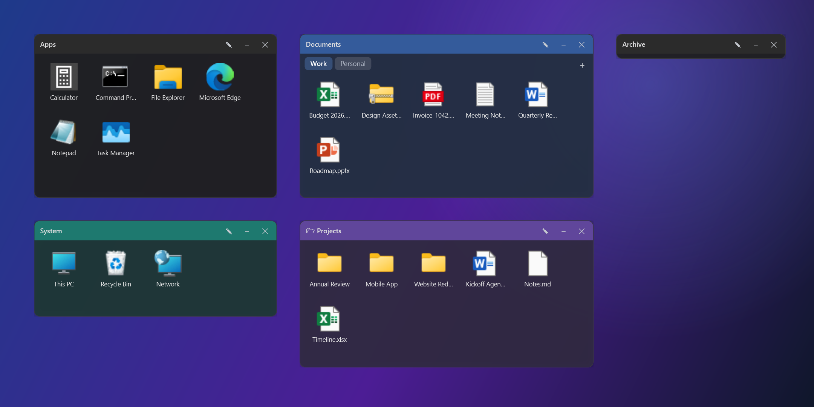
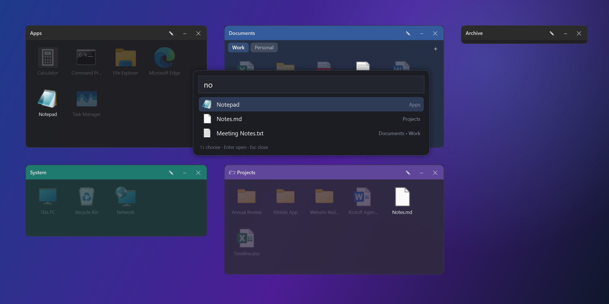
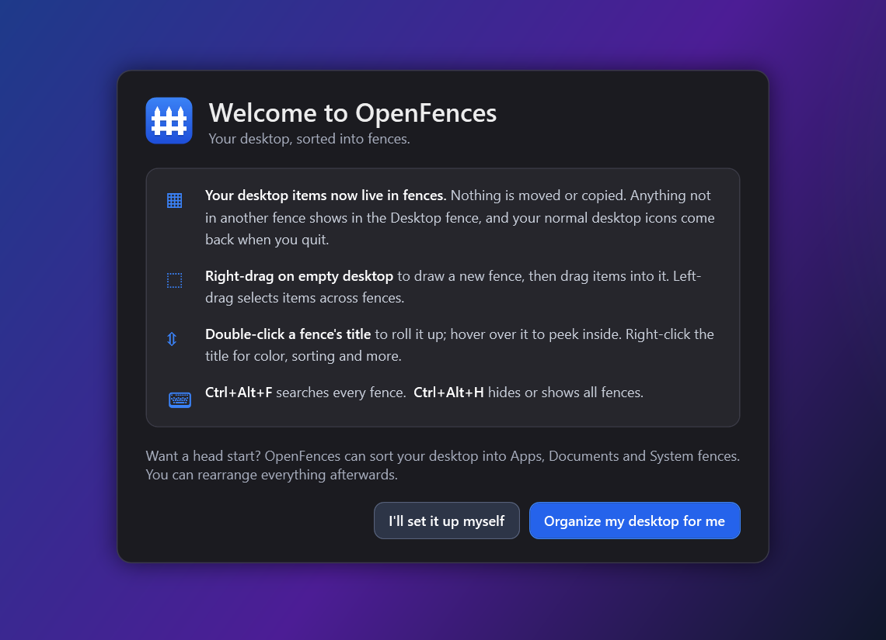

[](https://dotnet.microsoft.com/download/dotnet/8.0)


[](LICENSE)
[](https://github.com/chrisdfennell/OpenFences/releases)
[](https://github.com/chrisdfennell/OpenFences/stargazers)
[](https://github.com/chrisdfennell/OpenFences/issues)

# OpenFences

OpenFences is a lightweight, open-source WPF app for Windows that lets you organize your desktop into movable, resizable “fences.”  
Your real desktop items are shown as tiles inside fences. Nothing is copied and no shortcuts are created; a fence just decides where each desktop item appears. Group items into fences, mirror any folder as a **Folder Portal**, lasso-select across fences, and use **Auto-Import** to sort your desktop into **Apps**, **Documents**, and **System** fences in one click.

> Not affiliated with or endorsed by Stardock. “Fences” is a trademark of its respective owner. This project is an educational/utility clone built from scratch in C#.

---

## ✨ Features

- **Fences on the desktop layer**  
  Movable/resizable fence windows that sit above the wallpaper (nudged to the desktop Z-layer).

- **Fences hold your real desktop items**  
  While OpenFences runs, the normal desktop icons are hidden and each desktop item is shown in exactly one fence. Anything not in another fence lives in the **Desktop** fence. Quitting OpenFences shows the normal desktop icons again.

- **Drag in from anywhere**  
  Drop files from outside the desktop onto a fence and choose whether to move them onto the desktop or create a desktop shortcut.

- **Folder Portals**  
  A portal fence is a live view of any folder you choose; it updates as files change. Double-click a subfolder to browse into it (with a back button and breadcrumbs); Ctrl+double-click opens it in Explorer. Point a portal at a different folder with **Change folder…** or by dropping a folder onto it.

- **Remove vs. Delete**  
  Right-click an item → **Remove from fence** moves it back to the Desktop fence (nothing is deleted). **Delete** sends the real file to the Recycle Bin, after a clear confirmation.

- **Selection across fences**  
  Left-drag on empty desktop to lasso items in several fences; Ctrl+click and rubber-band selection work inside a fence.

- **Quick create & peek**  
  Right-drag on empty desktop to draw a new fence. Optionally double-click the desktop to hide/show all fences.

- **Rename & style fences**  
  Right-click a fence title bar to rename it, change sort order, icon size, transparency, **color** (preset swatches or any custom color) and **title size**.

- **Roll up, peek on hover**  
  Double-click a title bar to roll a fence up. Rest the mouse on a rolled-up fence (or drag files over it) and it opens until you move away.

- **Snap & align**  
  Fences snap to screen edges and to each other (aligned or side by side) while you move or resize them, with an optional grid. Hold **Alt** to move freely.

- **Search every fence**  
  **Ctrl+Alt+F** opens a quick search: matching items are listed (Enter opens one), fences come to the front, and everything that doesn't match fades out.

- **Global shortcuts**  
  **Ctrl+Alt+H** hides or shows all fences from anywhere, even while OpenFences is in the tray.

- **Keyboard friendly**  
  Arrow keys, Home/End and type-a-letter move through a fence; Enter opens, Delete recycles, F2 renames the fence, Esc clears the selection, Backspace goes up a folder in a portal.

- **Multi-monitor aware**  
  Each fence remembers where you put it for every monitor arrangement (docked, undocked, projector…) and returns there; fences that would land off-screen are pulled back onto a visible display.

- **Layout snapshots**  
  **File → Layouts** saves your whole fence layout and restores it later. A snapshot is also taken automatically before Auto-Import, rule sorting and restores, so big changes can be undone.

- **Automatic update checks**  
  OpenFences checks GitHub for a new release at startup and once a day, shows what's new, and installs it on request (one Windows permission prompt), then restarts with your fences intact. Turn it off under **Settings → Check for updates automatically**, or check any time with **Check for updates now…**. Portable-zip copies get a link to the download instead.

- **Safe, persisted layout**  
  Positions and sizes are saved automatically to `%AppData%\\OpenFences\\config.json`, with a backup of the previous version in `config.json.bak` that is restored automatically if the file is ever damaged.

- **Minimize to tray**  
  The main controller window hides to the system tray; double-click the tray icon to restore.

- **Dark UI**  
  Modern, semi-transparent main window + dark menus with slim scrollbars.

- **⚡ Auto-Import Desktop Icons**  
  One click creates (or reuses) three fences and sorts your desktop items into them:
  - **Apps**: shortcuts to apps, `.exe`, `.url`, `.bat/.cmd/.ps1/.msi`, etc.
  - **Documents**: everything else (documents, images, folders, zips…)
  - **System**: special items like *This PC*, *Network* and *Recycle Bin*.  
  Your files stay where they are on the desktop; only which fence shows them changes.

- **Auto-organize rules**  
  Turn on **Settings → Auto-organize new desktop items** and new files go straight to the right fence. **Edit auto-organize rules…** lets you choose what goes where (apps, folders, specific file types, everything else), reorder the rules, and re-sort the Desktop fence on demand.

---

## 📷 Screenshots







<sub>Screenshots are rendered from the real UI with demo content by `tools/Screenshots` (`dotnet run --project tools/Screenshots -- OpenFences/Docs`).</sub>

---

## 🧰 Tech

- .NET 8, WPF + a tiny bit of WinForms (`NotifyIcon` for the tray)
- Interop: `SHGetFileInfo` for icons, `WScript.Shell` COM to create/inspect `.lnk`
- No external packages

---

## 🔧 Build & Run

### Prerequisites
- Windows 10/11  
- [.NET 8 SDK](https://dotnet.microsoft.com/download)  
- (Optional) Visual Studio 2022 with “.NET desktop development” workload

### Via Visual Studio
1. Open the solution.  
2. Set **OpenFences** as the startup project.  
3. Build & Run (F5).

### Via CLI
```bash
dotnet build
dotnet run --project OpenFences/OpenFences.csproj
```

---

## 📁 Where things go

- **Your files:** they stay on your desktop. Fences don't copy or move them.  
- **Config:** `%AppData%\\OpenFences\\config.json` (previous version kept as `config.json.bak`)  
- **Layout snapshots:** `%AppData%\\OpenFences\\layouts\\`  
- **Error log:** `%AppData%\\OpenFences\\error.log`  
- **Uninstall:** quit OpenFences (your desktop icons reappear), uninstall it, and optionally delete `%AppData%\\OpenFences`.

---

## 🚀 Usage

- Create a fence: **File → New Fence**, or right-drag a rectangle on empty desktop.  
- Add items: drop files from Explorer onto a fence, or use **⚡ Auto-Import**.  
- Find something: **Ctrl+Alt+F**, type, Enter.  
- Hide/show all fences: **Ctrl+Alt+H** (or double-click empty desktop, if enabled in Settings).  
- Style a fence: right-click its title bar → **Color** / **Title size** / **Transparency**.  
- Save a layout: **File → Layouts → Save current layout…**; restore it from the same menu.  
- Take an item out of a fence: right-click it → **Remove from fence**.  
- Rename: right-click a fence title bar → **Rename…**.  
- Auto-import: click **⚡ Auto-Import Desktop Icons** to populate *Apps*, *Documents*, *System* fences.  
- Hide controller: minimize the main window; restore via tray icon (launching OpenFences again also brings it back).

---

## 🧭 Roadmap (ideas)

- Acrylic/Mica effects for fences (Win11)  
- Roll-up/peek animation (title-bar only)  
- Snap-to-grid & alignment guides  
- Pages / quick layouts  
- Per-fence rules (e.g., only images/docs)  
- Global hotkeys (show/hide all, new fence)  
- Stronger desktop parenting (WorkerW reparent)

---

## ⚠️ Known limitations

- Z-order on the desktop can vary by Windows build; we nudge fences toward the desktop layer to keep them behind normal windows (search brings them to the front while it's open).  
- A Folder Portal whose folder is missing or on a disconnected drive shows as *(unavailable)* until you reconnect it and restart OpenFences, or point it at another folder with **Change folder…**.  
- Ctrl+Alt+F / Ctrl+Alt+H don't work if another app already uses them; turn them off under **Settings → Global shortcuts** if they conflict.  
- Monitors with different scaling are handled with the system scale factor, so on mixed-DPI setups a fence can look slightly larger or smaller on one screen.

---

## 🤝 Contributing

PRs and issues welcome! If you’re proposing a new feature, please include a quick mock or description of the UI/UX.

- Fork and create a feature branch  
- `dotnet build` to ensure it compiles  
- Open a PR with a clear summary and screenshots if there are UI changes

---

## 📝 License

MIT © Christopher Fennell

---

## 🙏 Credits & Trademarks

- Built with .NET, WPF, and portions of the Windows Shell APIs.  
- Not affiliated with Stardock. “Fences” is a trademark of its respective owner.
