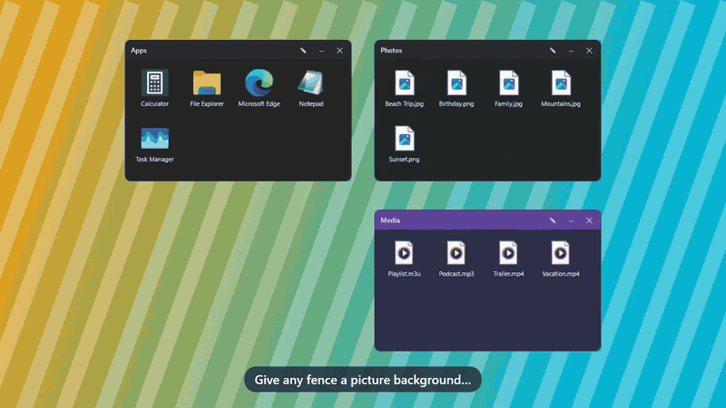
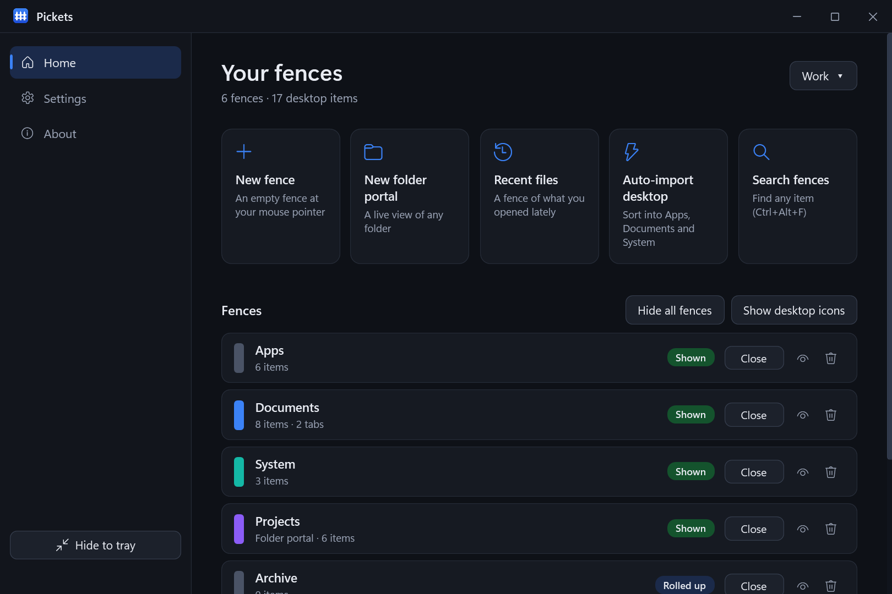
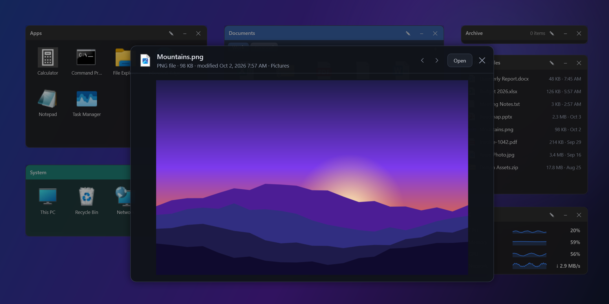
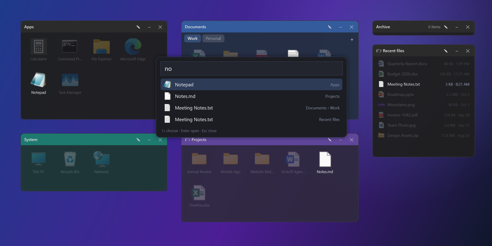
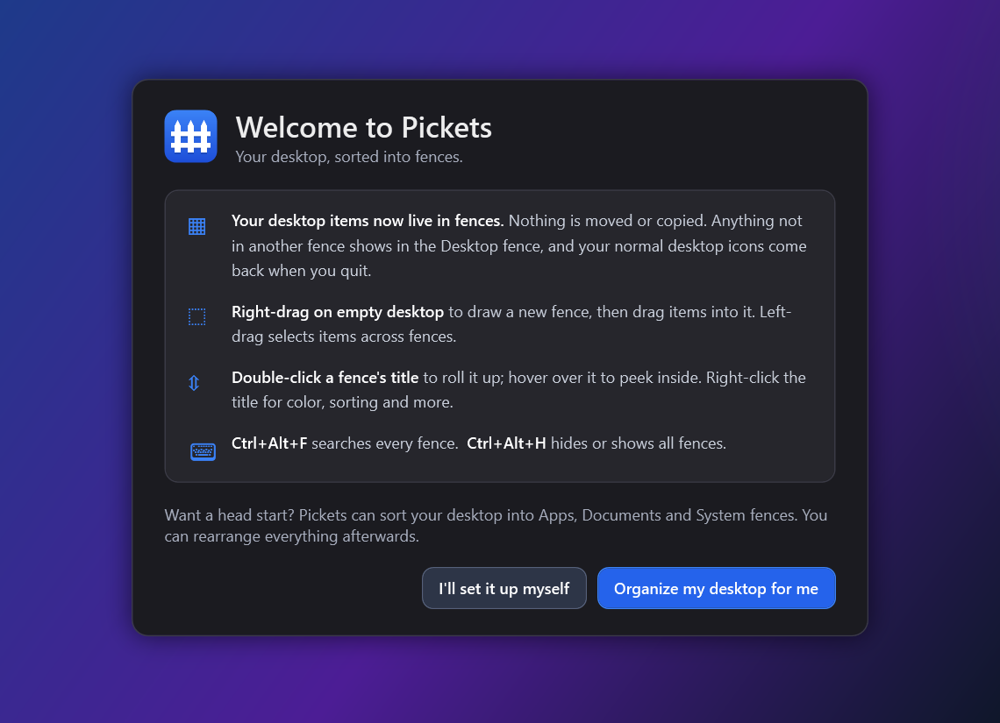

[](https://dotnet.microsoft.com/download/dotnet/8.0)


[](LICENSE)
[](https://github.com/chrisdfennell/Pickets/releases)
[](https://github.com/chrisdfennell/Pickets/stargazers)
[](https://github.com/chrisdfennell/Pickets/issues)

# Pickets

*Formerly **OpenFences**.* A free, open-source alternative to Stardock Fences.

**Website:** [chrisdfennell.github.io/Pickets](https://chrisdfennell.github.io/Pickets/) · [Privacy policy](https://chrisdfennell.github.io/Pickets/privacy.html) · [Download](https://github.com/chrisdfennell/Pickets/releases/latest)

Pickets organizes your Windows desktop into movable, resizable **fences**. Your real desktop items show up as tiles inside fences. Nothing is copied or moved and no shortcuts are created: a fence only decides where each desktop item appears, and quitting Pickets brings your normal desktop back.



> Not affiliated with or endorsed by Stardock. “Fences” is a trademark of its respective owner. Pickets is an independent project, written from scratch in C#.

---

## 📦 Install

Requires Windows 10 or 11. No .NET installation is needed.

- **Installer (recommended):** download `Pickets-x64.msi` (most PCs) or `Pickets-arm64.msi` (ARM devices such as Snapdragon laptops) from the [latest release](https://github.com/chrisdfennell/Pickets/releases/latest).
- **Portable:** `Pickets-x64-portable.zip` or `Pickets-arm64-portable.zip`; unzip anywhere and run `Pickets.exe`.
- **winget:** `winget install chrisdfennell.Pickets` (submitted to the Windows Package Manager; works once Microsoft approves it).

After that, Pickets checks GitHub for new versions and installs them when you say so.

**Upgrading from OpenFences?** Install Pickets over it (or accept the update OpenFences offers). Your fences, settings and saved layouts move over automatically the first time Pickets starts. Start it once from the Start menu after the update; older versions can't restart the app under its new name.

---

## ✨ Features

### Organize

- **Fences hold your real desktop items.** Each desktop item shows in exactly one fence; anything not in another fence lives in the **Desktop** fence.
- **Tabs inside fences.** Split a busy fence into tabs (fence menu → **Add tab…**). Click a tab or press **Ctrl+Tab** to switch, drag tiles onto a tab to move them, right-click a tab to rename or delete it.
- **Folder portals.** A fence that shows any folder live. Double-click a subfolder to browse into it (with a back button and breadcrumbs); point it at another folder with **Change folder…** or by dropping a folder on it.
- **Auto-Import.** One click sorts your desktop into **Apps**, **Documents** and **System** fences.
- **Auto-organize rules.** New desktop files go straight to the right fence, by type (apps, folders, file extensions, everything else), and the Desktop fence can be re-sorted on demand.
- **Drag tiles anywhere.** Onto another fence to move them, within a fence to arrange your own order, or into Explorer, email or any app as real files. Files dragged in from elsewhere can be moved onto the desktop or added as a shortcut.
- **Move to fence.** Right-click tiles → **Move to fence…** (another fence, or one of its tabs) or **Move to new fence**, which creates a fence right beside the current one holding the selection.
- **Select across fences.** Left-drag on empty desktop to lasso items in several fences; Ctrl+click and rubber-band selection work inside a fence.
- **Close or delete.** ✕ closes a fence and it stays closed (it keeps its items) until you reopen it from the Pickets window; **Delete Fence…** removes it and its items go back to the Desktop fence. Nothing on your disk is deleted either way.

### Find and open

- **Search every fence.** **Ctrl+Alt+F** searches every fence and tab: matches are listed (Enter opens one), fences come to the front and everything else fades out.
- **Quick Look.** Press **Space** on a tile for a large preview: pictures, video and audio with sound, text and code, or file details. Arrow keys step through the fence; Enter opens.
- **The real Windows right-click menu.** Open with, Send to, Properties and menu entries other apps add, plus **Remove from fence**. **Rename** (or F2) renames the actual file, and it stays in its fence, as do files renamed in Explorer or saved by apps such as Office.
- **Keyboard friendly.** Arrow keys, Home/End and type-a-letter move through a fence; Space previews, Enter opens, Delete recycles, F2 renames, Esc clears the selection, Backspace goes up a folder in a portal.

### Make it yours

- **Style each fence.** Colors (presets or any custom color), title size, transparency, **frosted glass**, or a **picture or looping video background** (fill, fit or stretch, optional darkening, sound on or off per video).
- **Thumbnails.** Pictures and videos show a preview instead of a generic icon; file extensions can be hidden. Hover a tile for its full name, type, size, date and folder.
- **Size things quickly.** **Ctrl + mouse wheel** over a fence changes its icon size; **Fit to contents** (fence menu) sizes the fence to its tiles. Rolled-up fences show how many items they hold.
- **Roll up and peek.** Double-click a title to roll a fence up; rest the mouse on it (or drag files over it) to open it until you move away.
- **Snap and align.** Fences snap to screen edges and to each other while you move or resize them, with an optional grid. Hold **Alt** to move freely. Lock a fence to stop accidental moves.

### Stays out of your way

- **One home for everything.** The Pickets window lists every fence with its state (shown, rolled up, closed) and buttons to open, close, locate or delete it, plus quick actions, a **Settings** page with simple switches, and About. It hides to the system tray and reopens where you left it.
- **Global shortcuts.** **Ctrl+Alt+H** hides or shows all fences from anywhere; both shortcuts can be changed in Settings.
- **Multi-monitor aware.** Each fence remembers where you put it for every monitor setup (docked, undocked, projector) and is never left off-screen.
- **Layouts you can undo.** Save and restore whole layouts; one is saved automatically before big changes such as Auto-Import.
- **Updates itself.** Checks GitHub at startup and once a day, shows what's new and installs on request (one Windows permission prompt), keeping your fences. Can be turned off.
- **Safe settings.** Saved continuously with a backup copy that's restored automatically if the file is ever damaged.

---

## 📷 Screenshots










<sub>Screenshots are rendered from the real UI with demo content by `tools/Screenshots` (`dotnet run --project tools/Screenshots -- Pickets/Docs`); the backgrounds clip is recorded by `tools/DemoVideo` (needs ffmpeg).</sub>

---

## 🚀 Using Pickets

- **Create a fence:** right-drag a rectangle on empty desktop, or **New fence** on the Pickets window's Home page.
- **Fill it:** drag tiles in from other fences, drop files from Explorer, or use **Auto-import desktop** on the Home page.
- **Fence options:** right-click a fence's title bar (or click ✎) to rename it, sort, change icon size, add a tab, set a color, background, transparency or title size, lock it, or delete it.
- **Find something:** **Ctrl+Alt+F**, type, Enter. Or select a tile and press **Space** to preview it.
- **Hide or show all fences:** **Ctrl+Alt+H**, or double-click empty desktop if that's turned on in Settings.
- **Reopen a closed fence:** open the Pickets window; closed fences are listed on Home with an **Open** button.
- **Save or restore a layout:** **Settings → Layouts**.
- **Rules for new files:** **Settings → Organizing → Edit rules…**.
- **Start over:** **Settings → Start over → Delete all fences…** (the current layout is saved first).
- **Bring back the window:** double-click the tray icon, or start Pickets again.

---

## 📁 Where things go

- **Your files:** they stay where they are. Fences don't copy or move them.
- **App:** `C:\Program Files\Pickets\` (installer) or wherever you unzipped the portable version.
- **Settings and fences:** `%AppData%\Pickets\config.json` (previous version kept as `config.json.bak`).
- **Saved layouts:** `%AppData%\Pickets\layouts\`
- **Error log:** `%AppData%\Pickets\error.log`
- **Coming from OpenFences:** `%AppData%\OpenFences` is moved to `%AppData%\Pickets` on first start.
- **Uninstall:** quit Pickets (your desktop icons reappear), uninstall it from Windows Settings, and optionally delete `%AppData%\Pickets`.

Pickets collects no personal data and has no telemetry; see the [privacy policy](https://chrisdfennell.github.io/Pickets/privacy.html).

---

## 🔧 Build and run

You need Windows 10/11 and the [.NET 8 SDK](https://dotnet.microsoft.com/download) (Visual Studio 2022 with the ".NET desktop development" workload is optional).

```bash
dotnet build
dotnet run --project Pickets/Pickets.csproj
dotnet test tests/Pickets.Tests
```

In Visual Studio, open `Pickets.sln`, set **Pickets** as the startup project and press F5. The MSI installer is built with WiX (`Pickets.Installer`); CI builds it for x64 and ARM64 on every tagged release.

---

## 🧰 Tech

- .NET 8 and WPF, with a little WinForms for the tray icon.
- Windows Shell integration: the real context menu (`IContextMenu`), thumbnails (`IShellItemImageFactory`), icons (`SHGetFileInfo`), shortcuts (`WScript.Shell`).
- Win32: desktop-layer placement and stacking, `RegisterHotKey` for global shortcuts, accent-policy blur for frosted glass.
- No third-party packages in the app; tests use xUnit.

---

## 🧭 Roadmap (ideas)

- Compact list view for long fences
- Smarter rules (by name pattern, age or size)
- Light theme that follows Windows
- Export and import layouts as a file
- Different fences per virtual desktop
- Sticky-note fences
- Proper per-monitor DPI on mixed-scaling setups
- Screen reader support and translations

Ideas and votes are welcome in [issues](https://github.com/chrisdfennell/Pickets/issues).

---

## ⚠️ Known limitations

- Z-order on the desktop can vary by Windows build; fences are kept in the desktop layer behind normal windows (search and Locate bring them to the front briefly).
- A folder portal whose folder is missing or on a disconnected drive shows as *(unavailable)* until you reconnect it and restart Pickets, or point it at another folder with **Change folder…**.
- A global shortcut that another app already uses can't be registered; Settings flags it so you can pick another.
- Monitors with different scaling use the system scale factor, so on mixed-DPI setups a fence can look slightly larger or smaller on one screen.
- Background videos need Windows' codecs: MP4 and WMV work out of the box; MKV and WebM may need the free extensions from the Microsoft Store. Animated GIFs show their first frame.

---

## 🤝 Contributing

PRs and issues welcome! If you're proposing a new feature, please include a quick mock or description of the UI.

- Fork and create a feature branch.
- Make sure `dotnet build` and `dotnet test tests/Pickets.Tests` pass (CI runs the tests on every push).
- Open a PR with a clear summary, and screenshots if the UI changes.
- Maintainers: see [docs/RELEASING.md](docs/RELEASING.md) for releases, code signing and winget.

---

## 📝 License

MIT © Christopher Fennell

---

## 🙏 Credits and trademarks

- Built with .NET, WPF and the Windows Shell APIs.
- Not affiliated with Stardock. “Fences” is a trademark of its respective owner.
